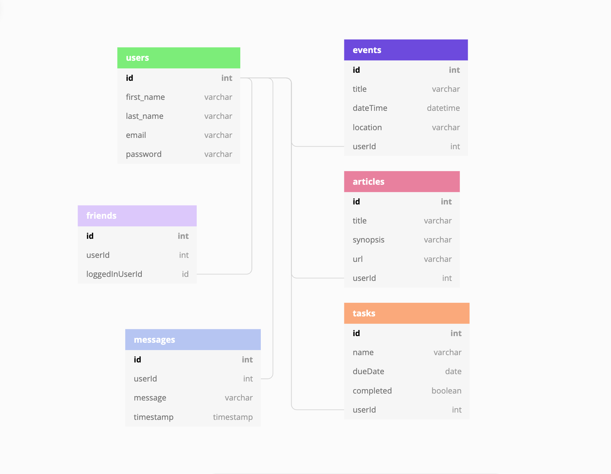

# Otter: The Information Dashboard

## Preface

The contributors to this project were Jeremiah Bell, Charles Jackson, Michelle Johnson, and Sam Pita.

We took time before writing any code to develop an Entity Relationship Diagram laying out our database relationships. This is shown below:



## Why is the application called Otter?

Otters are social animals. They hold hands while sleeping so they don't drift apart from each other. We named this application Otter to represent staying connected to one another with this information dashboard.

## Download Instructions

1. Click the green "Clone or download" button located at the top right of this repository.
1. Copy the link below *Clone with SSH*
1. Run the command `git clone <paste link here>`
1. `cd` into the directory it creates
1. In the `api` directory, create a copy of the `database.json.example` and remove the .example extension.
1. Run `npm install` and wait for all dependencies to be installed
1. Run `npm start` to verify that installation was successful.

## Application Instructions

Nutshell is a new product offering that you have been tasked with building. It's a dashboard for people to use to organize their daily tasks, events, news article, friends, and chat messages.

You will be utilizing all of the skills and concepts that you've learned up to this point in the course.

1. Functions
1. Databases/API ([JSON Server Documentation](https://github.com/typicode/json-server))
1. Github
1. Objects
1. CSS/Flexbox
1. Array methods
1. Handling user events
1. Factory functions
1. Implementing CRUD operations
1. Modular code with Webpack
1. Relational data

To start you off, here's an example of what the resources in your API should look like once it's populated with some data from your application.

### Users

```json
{ "id": 1, "username": "Steve", "email": "me@me.com" }
```

### Messages

```json
{ "id": 1, "userId": 1, "message": "What's up?" }
```

### News

```json
{
    "id": 1,
    "userId": 2,
    "url": "https://www.quantamagazine.org/newfound-wormhole-allows-information-to-escape-black-holes-20171023/",
    "title": "Wormholes Allow Information to Escape Black Holes",
    "synopsis": "Check out this recent discovery about workholes"
}
```

### Friends

```json
{ "id": 1, "userId": 1, "loggedInUserId": 3 }
```

### Tasks

```json
{ "id": 1, "userId": 3, "task": "Take out garbage" }
```

## Professional Requirements

1. All teammates must be using Webpack to compile their code.
1. Each module should have a comment at the top with the following info: author(s) and purpose of module
1. The README for your project should include instructions on how another person can download and run the application
1. An ERD showing the database relationships. A screenshot/image should be included on your README.
